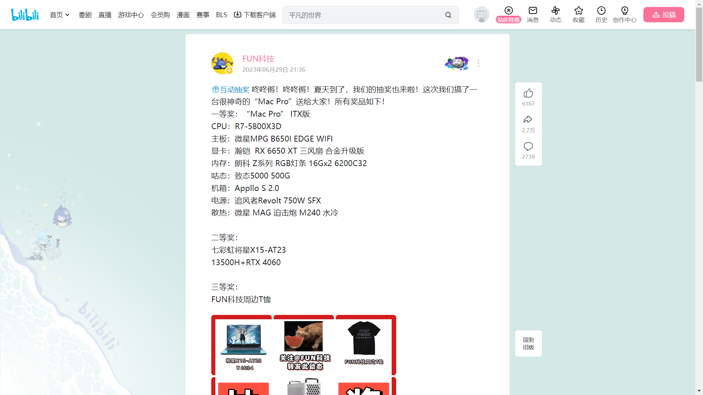

## Ⅰ.简介

常刷B站的伙伴们，是不是每次看到Up主的抽奖活动都心动不已，毕竟`抽奖总得试试吗，万一中奖了呢`，然后一波关注+转发之后，迎来的每每都是`从不缺席，从不中奖`。

So，如果有个小脚本能够帮助你去看看**今天有哪些Up有抽奖活动，然后还能帮助你自动进行抽奖（转发动态+关注）**，那么你是不是可以花更多时间去看看二次元动漫呀。本着有羊毛一起薅的想法，我做了一个B站自动抽奖活动转发的小脚本，帮助伙伴们自动参与Up主的活动转发，提高伙伴们的中奖率，同时还能解放大家的双手，开开心心薅羊毛。

**声明**: <u>**此脚本仅用于学习和测试，作者本人并不对其负责，请于运行测试完成后自行删除，请勿滥用！**</u>

## Ⅱ.效果

本程序内置一个扫描脚本，该脚本去挖掘那些经常转发抽奖动态的伙伴，然后每天定时去扫描他们今天的动态信息，随后再利用一个抽奖动态识别与转发脚本来进行活动参与，转发后的效果是这样的：



## III.使用：Docker部署（推荐）

### 1.克隆本项目

```bash
git clone https://github.com/rongchenlin/BiliBili-Lucky-Draw.git
cd BiliBili-Lucky-Draw
```

### 2.配置环境变量

复制 `.env.example` 为 `.env`，设置 `MYSQL_PASSWORD` 和 `MYSQL_ROOT_PASSWORD`，并按需调整订阅 UP、转发内容等配置。请勿将包含实际凭据的 `.env` 提交到仓库。

Linux/macOS：

```bash
cp .env.example .env
```

Windows PowerShell：

```powershell
Copy-Item .env.example .env
```

### 3.构建并启动容器

在项目目录运行：

```bash
docker compose build
docker compose up -d
```

管理页面：[Bili Draw Console](http://127.0.0.1:18000/) · [脱敏预览](admin-preview.html)

首次使用时，在“用户管理”页面添加用户并扫码登录。每个用户使用独立的 Cookie 会话，Cookie 保存在项目的 `cookie` 目录中。管理页面还提供按用户的开奖统计、备注管理、手动任务、动态识别队列、运行日志和清理设置。

查看容器状态和日志：

```bash
docker compose ps
docker compose logs -f admin_web dynamic_share
```

停止容器：

```bash
docker compose down
```

数据库文件保存在项目目录的 `db_data` 中；停止或重建容器不会删除该目录。


## IV.TODO && Updated

- [x] 项目采用Docker部署
- [x] 扫描B站二维码登录B站，自动生成Cookie并保存到本地项目文件夹cookie中
- [x] 登录过期，使用Cookie续期
- [x] 每日任务执行情况推送（之前用的方糖酱，后续将重新加入）
- [x] 将数据库搭建的工作使用Docker部署
- [x] Docker服务编排，一键部署
- [x] 开发桌面程序(目前只是简单版本)
- [x] 过期动态的删除
- [x] 接入B站UP主每日总结的抽奖动态列表，自动完成对其转发
- [x] 多用户 Cookie 会话、用户备注及按用户开奖统计
- [x] Web 管理控制台：手动任务、动态管理、运行日志和运行设置

---
